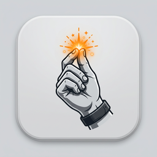

<p align="center">
  
</p>

<h1 align="center">Snap-rs</h1>

<p align="center">
  macOS Dock keyboard shortcut manager — a Rust reimplementation of <a href="https://apps.apple.com/us/app/snap/id418073146?mt=12">Snap</a>.<br/>
  Automatically assigns global keyboard shortcuts (Cmd+1 ~ Cmd+0) to the first 10 apps in your macOS Dock.<br/>
  Press a shortcut to launch or switch to the app; press again to hide it.
</p>

## Features

- **Dock shortcut mapping** — Cmd+1 through Cmd+0 mapped to your first 10 Dock apps
- **Toggle behavior** — press once to activate, press again to hide
- **Menu bar app** — runs in the system tray, no Dock icon
- **Auto-detect Dock changes** — polls every 5 seconds, re-registers shortcuts automatically
- **Launch at Login** — optional autostart support
- **Enable/Disable shortcuts** — global toggle switch
- **App icons** — extracts icons from app bundles and displays them in the settings UI
- **Dark mode** — follows macOS system appearance
- **Native feel** — macOS-style UI with SF font and system colors

## Tech Stack

- **Backend**: Rust + [Tauri v2](https://v2.tauri.app/)
- **Frontend**: Svelte 5 + TypeScript
- **Build**: Vite + pnpm

## Prerequisites

- macOS 12.0+ (Monterey or later)
- [Rust](https://rustup.rs/) >= 1.77
- [Node.js](https://nodejs.org/) >= 18
- [pnpm](https://pnpm.io/) >= 8

## Development

```bash
# Install dependencies
pnpm install

# Run in dev mode (hot-reload frontend + Rust rebuild)
pnpm tauri dev

# Type-check frontend
pnpm check
```

## Build

```bash
# Production build — outputs .app and .dmg
pnpm tauri build
```

Build artifacts:

| Output | Path |
|--------|------|
| macOS App | `src-tauri/target/release/bundle/macos/Snap-rs.app` |
| DMG Installer | `src-tauri/target/release/bundle/dmg/Snap-rs_0.1.0_aarch64.dmg` |

The `pnpm tauri build` command does the following:
1. Builds the Svelte frontend via Vite (`pnpm build`)
2. Compiles the Rust backend in release mode (`cargo build --release`)
3. Bundles into `Snap-rs.app` (macOS application bundle)
4. Creates a `.dmg` disk image installer via `bundle_dmg.sh`

## Project Structure

```
snap-rs/
├── src-tauri/                     # Rust backend
│   ├── src/
│   │   ├── lib.rs                 # App entry, plugin setup, polling
│   │   ├── main.rs                # Binary entry point
│   │   ├── tray.rs                # System tray menu
│   │   ├── commands.rs            # Tauri IPC commands
│   │   ├── app_launcher.rs        # Launch/hide apps (toggle)
│   │   ├── dock/
│   │   │   ├── reader.rs          # Parse com.apple.dock.plist
│   │   │   └── types.rs           # DockApp struct
│   │   ├── shortcut/
│   │   │   └── manager.rs         # Global shortcut registration
│   │   └── icon/
│   │       └── extractor.rs       # icns -> PNG -> base64
│   ├── Cargo.toml
│   └── tauri.conf.json
├── src/                           # Svelte frontend
│   ├── routes/+page.svelte        # Main settings page
│   ├── components/
│   │   ├── DockAppList.svelte     # Dock apps table
│   │   ├── SettingsPanel.svelte   # Toggle switches
│   │   └── AboutSection.svelte    # App info
│   └── lib/
│       ├── api.ts                 # Tauri invoke wrappers
│       └── types.ts               # TypeScript interfaces
├── .github/workflows/
│   └── release.yml                # GitHub Actions: build & release
└── package.json
```

## How It Works

1. Reads `~/Library/Preferences/com.apple.dock.plist` using the `plist` crate
2. Extracts app name, bundle identifier, and icon from each Dock entry
3. Registers `Cmd+1` ~ `Cmd+0` via `tauri-plugin-global-shortcut`
4. On shortcut press:
   - If the app is **not frontmost** → `open -b <bundle_id>` (launch/activate)
   - If the app **is frontmost** → hides it via AppleScript (`System Events`)
5. Background thread polls the Dock plist every 5 seconds for changes

## License

MIT
